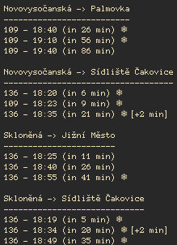

# TRS 

Transportation timetambles for command line.



## Installation

```
cargo install --git https://github.com/im-n1/transpors
```

## Usage

Note: When installed the binary is named `trs` for convenience.

### Wizard

When you run the app for the first time a wizard will welcome you and
walk you thru the setup process. All you need is GTFS file URL or location
on your drive.

Such GTFS file can be found on the internet on your local transporation company
website. Apps like [Citymapper](https://citymapper.com/) uses exactly these
files. There is also [this](https://transitfeeds.com/) portal where you can try
to find your city.

### Print timetables

Except wiping (`-w`) the app always prints out the timetables of your stations.

```
$ trs

Skloněná -> Sídliště Čakovice
-----------------------------
136 - 13:20 (+14 min)
136 - 13:35 (+29 min)
136 - 13:50 (+44 min)
```

### Refreshing database

When a new version of GTFS file is available you can simply refresh your app database
with just one command. If the GTFL file location is URL it will be downloaded automatically.

```
$ trs -r
```

### Add/delete stops

```
$ trs -a  # to add new stops
$ trs -d  # to delete existing stops
```

### Wiping whole app

```
$ trs -w  # wipes whole app database - cannot be undone.
```

## Changelog

### 0.1.3

- log messages (CLI output) unified
- dependencies bumped to newer versions

### 0.1.2

- timetables are now sorted by stop name
- dependencies bumped to newer versions which brings notably better performance
- ! you need to rebuild your database after this update

### 0.1.1

- added relative times
- added a few words about GTFS to README filte
- updated dependencies

### 0.1

- initial release
